# DeepShare

Because real should be provable.

## Resources

- [Pitch Deck](https://www.canva.com/design/DAG7Q0oIhho/3yLd0P4UmiLTEozsdq67hQ/view?utm_content=DAG7Q0oIhho&utm_campaign=designshare&utm_medium=link2&utm_source=uniquelinks&utlId=h8b545d3ce3)
- [Demo Video](https://youtu.be/lzSAHpoP6_s)
- [Live Demo](https://deepshare-frontend.vercel.app)
- Parent Asset Example - [View on Aeneid Explorer](https://aeneid.explorer.story.foundation/ipa/0xCfE1B5f98d0598c8d9D47Ecaf3Da9A91EEf171f2)
- Derivative Asset Example - [View on Aeneid Explorer](https://aeneid.explorer.story.foundation/ipa/0xc186f49CA5BA3916A030AdBbA6C7C14E6674fcE7)
- Depth metadata of an example image captured - [View Here](https://github.com/Marshal-AM/DeepShare/blob/main/raspberry-pi/depth_capture_1763863841.json)

---

## How to Use

### Uploading Depth-Verified Images to Our Platform

1. On your Raspberry Pi (4GB RAM or above), run the following command:
   ```bash
   git clone https://github.com/Marshal-AM/deepshare.git && cd raspberry-pi && chmod +x register_device.sh && ./register_device.sh
   ```

2. Set your minting fee and royalty share percentage.

3. Scan the generated QR Code and register your device in the DeepShare platform.

4. Start capturing images!

### Using Media Available from the Platform

1. Visit the DeepShare marketplace - [Click Here](https://deepshare-frontend.vercel.app/marketplace).

2. Select the asset you want to use.

3. Press "Use this Asset".

   **NOTE**: Make sure you have enough $IP testnet tokens to complete this transaction. You can obtain testnet tokens from the [Story Protocol Aeneid Faucet](https://cloud.google.com/application/web3/faucet/story/aeneid).

4. You now have rights to the asset!

### Testing Royalty Payments and Derivative Usage

The DeepShare platform includes a comprehensive test page for simulating real-world usage scenarios and royalty payment flows for derivative assets. This allows users to understand how the revenue system works before deploying in production.

1. **Navigate to Test Page**
   - Visit the test royalty page at [https://deepshare-frontend.vercel.app/test-royalty](https://deepshare-frontend.vercel.app/test-royalty) (requires wallet connection)
   - Ensure your MetaMask wallet is connected to the Aeneid network

2. **Select a Derivative Asset You Minted**
   - If you havent minted a derivative asset, follow the previous section's steps to mint one.
   - The page displays all derivative assets you've minted from the marketplace
   - Select a derivative from the grid to begin testing

3. **Fetch License Terms**
   - Click "Fetch License Terms" to load available license terms for the selected derivative
   - Review the minting fee and revenue share percentage for each license option

4. **Simulate Usage**
   - Enter the number of license tokens to mint (default: 1)
   - Click "Simulate Usage" to execute the royalty payment flow
   - The system will:
     - Mint license tokens using `mintLicenseTokens` ([`app/test-royalty/page.tsx:188`](app/test-royalty/page.tsx#L188))
     - Pay the required minting fee in $WIP tokens
     - Distribute revenue to the original asset owner based on the configured revenue share percentage
     - Display transaction hashes and detailed logs of the process

5. **View Transaction Details**
   - All transactions are logged with timestamps and status
   - Click transaction links to view on Aeneid explorer
   - Example license token mint transaction: [View on Aeneid](https://aeneid.storyscan.io/tx/0x8f29167303f5ca0a0788382730eb5a02e4f8c1bc7a95596f7e875f62b18b4dfd)

**Screenshots**:
<!-- TODO: Add screenshot of test-royalty page with derivative selection -->
<!-- TODO: Add screenshot of license terms display -->
<!-- TODO: Add screenshot of usage simulation with logs -->

**NOTE**: This test page demonstrates the complete royalty flow including license token minting, fee payment, and revenue distribution. All transactions occur on the Aeneid testnet using real Story Protocol contracts.

---

## Developments Actively Being Worked On

DeepShare is continuously evolving to expand device compatibility and enhance verification capabilities. The following developments are currently in active development:

1. **Video Upload Support (XR Motion Capture)**: Extending the platform to support video uploads with depth data from XR motion capture systems. This will enable verification of dynamic events and motion sequences, providing temporal depth information that complements static image captures. The system will process video frames with depth metadata and create verifiable video assets on the blockchain.

2. **Mobile Device Support**: Developing support for Android devices with dual camera systems using Termux, enabling users to capture depth-verified images directly from their smartphones. This expansion will significantly increase accessibility, allowing anyone with a compatible Android device to contribute verified content without requiring specialized hardware.

3. **Meta Ray-Ban Smart Glasses Integration**: Creating a mobile application that interfaces with Meta Ray-Ban smart glasses to enable hands-free depth-verified image capture. This development will provide a seamless, wearable solution for real-time evidence capture, making verification accessible in field conditions where traditional cameras may be impractical.

4. **AI-Powered Verification Layer**: Implementing an additional verification layer that uses machine learning models to analyze depth data patterns and detect anomalies that might indicate tampering or synthetic generation. This complementary verification mechanism will work alongside cryptographic proofs to provide multi-layered authenticity validation, further strengthening the platform's ability to distinguish genuine captures from AI-generated content.

---

## Table of Contents

- [Introduction](#introduction)
- [Problem Statement](#problem-statement)
- [Our Solution](#solution)
- [How it Works](#how-it-works)
- [Revenue System](#revenue-system)
- [System Architecture](#system-architecture)
- [Project Flow](#project-flow)
  - [Phase 1: Device Calibration](#phase-1-device-calibration)
  - [Phase 2: Device Registration](#phase-2-device-registration)
  - [Phase 3: Image Capture & Depth Mapping](#phase-3-image-capture--depth-mapping)
  - [Phase 4: IPFS Upload & Storage](#phase-4-ipfs-upload--storage)
  - [Phase 5: IP Asset Registration](#phase-5-ip-asset-registration)
  - [Phase 6: Derivative IP Minting](#phase-6-derivative-ip-minting)
- [Conclusion](#conclusion)

---

## Introduction

DeepShare is a platform that enables users to upload images coupled with their corresponding depth metadata and mint intellectual property (IP) rights for both the image and its depth data. The platform combines stereo vision depth mapping technology with blockchain-based IP protection to create a verifiable, tamper-proof system for authenticating real-world visual data.

---

## Problem Statement

The proliferation of highly convincing AI-generated images has created a critical challenge in distinguishing between verified, authentic data and synthetically generated content. This problem has become a significant source of misinformation and public confusion, as demonstrated by recent incidents where AI-generated content has been mistaken for real events.

(We saw one such incident literally when writing this readme! [Click here to read](https://www.superherohype.com/news/640047-avengers-doomsday-cast-photos-tobey-maguire-doctor-strange))

The inability to verify the authenticity of visual data has far-reaching consequences across multiple sectors. Organizations that rely on accurate, real-world data face increasing difficulty in sourcing trustworthy visual content. This challenge affects:

- **News Outlets**: Media organizations require verified proof captured by actual individuals in the physical world to ensure the authenticity of their reporting and maintain public trust.
- **Scientific Researchers**: Research institutions need access to genuine, depth-verified imagery to ensure the accuracy and reproducibility of their findings.
- **Law Enforcement and Legal Systems**: Courts and investigative agencies require credible visual evidence with verifiable provenance for use in legal proceedings.

The current information ecosystem lacks a reliable mechanism to verify the physical authenticity of visual data, creating vulnerabilities that can be exploited to spread misinformation and undermine trust in digital content.

---

## Solution

DeepShare addresses this challenge through a comprehensive system that combines depth-verified image capture with blockchain-based intellectual property registration. The platform consists of two primary components:

### Capture Software

We have developed specialized software that can run on **wearables** and other portable devices such as **smart glasses** and mobile phones with dual camera systems or devices equipped with **LIDAR sensors**. This software captures images along with their corresponding depth metadata and directly mints intellectual property rights using **Story Protocol** for both the image and its depth data.

The software has been tested and validated in the following prototype setup:


The capture system uses stereo vision depth mapping to generate accurate depth information, which serves as a cryptographic proof of physical authenticity. Each captured image is cryptographically signed using EIP-191 signatures, creating an immutable record of the capture event.

### Platform Infrastructure

We have developed a web-based platform where users can register their capture devices and organizations requiring verified data can browse uploaded images and mint derivatives for their use. The platform provides:

- **Device Registration**: Users register their capture devices, which generates a unique cryptographic identity linked to the device hardware.
- **Image Marketplace**: Organizations can browse verified images with depth metadata, view licensing terms, and mint derivatives for commercial or non-commercial use.
- **Royalty Management**: Automated royalty distribution ensures image contributors receive compensation when their data is used by others.
- **IP Asset Management**: All registered images are minted as IP assets on Story Protocol, providing blockchain-backed provenance and licensing terms.


### Benefits

This solution **provides value** to all parties involved:

1. **Image Contributors**: Contributors receive ongoing royalties through Story Protocol's Programmable IP License (PIL) system when organizations mint derivatives of their uploaded data. This creates a sustainable economic model that incentivizes the capture and sharing of authentic real-world data.

2. **Organizations Requiring Trusted Data**: News outlets, scientific research institutions, law enforcement agencies, educational institutions, and other organizations gain access to a marketplace of verified, depth-authenticated visual data. Each asset includes cryptographic proof of physical capture, enabling organizations to confidently use the data knowing it represents genuine real-world content.

3. **General Public**: As the platform scales, the widespread availability of verified, blockchain-authenticated data creates a fundamental shift in how society consumes visual information. By providing accessible verification mechanisms, the platform addresses the root cause of misinformation: the inability to distinguish authentic content from AI-generated fabrications. This infrastructure has the potential to significantly reduce the impact of AI-generated fake news and restore trust in digital visual content, creating a more informed and resilient information ecosystem.

---

## How it Works

<div align='center'>

</div>

<div align='center'>

</div>

DeepShare operates through a six-phase pipeline that transforms physical image capture into blockchain-verified intellectual property assets:

1. **Device Calibration**: Stereo cameras are calibrated using checkerboard patterns to generate rectification maps and depth computation parameters. This establishes the geometric relationship between cameras required for accurate depth mapping.

2. **Device Registration**: Each capture device generates a unique Ethereum wallet and registers with the platform. Device hardware details are collected and linked to the wallet address, creating a cryptographic identity for the device. The device owner configures licensing terms including minting fees and revenue share percentages.

3. **Image Capture & Depth Mapping**: The device captures synchronized stereo images, computes depth maps using Semi-Global Block Matching (SGBM) algorithms, and creates a cryptographically signed payload. Each capture includes the original image, depth data, and an EIP-191 signature proving authenticity.

4. **IPFS Upload & Storage**: Images and metadata are uploaded to IPFS via Pinata, generating Content Identifiers (CIDs). The platform stores image CIDs, metadata CIDs, and wallet addresses in Supabase for querying and marketplace display.

5. **IP Asset Registration**: Captured images are registered as IP assets on Story Protocol. The system creates IP metadata and NFT metadata, uploads them to IPFS, mints NFTs in a collection, and attaches Programmable IP Licenses (PIL) with configured minting fees and revenue shares. The IP asset ID and transaction hash are stored in Supabase.

6. **Derivative IP Minting**: Organizations browse the marketplace, select assets, and mint derivative IP assets. Users select license terms (commercial or non-commercial), the system generates derivative metadata, uploads it to IPFS, and registers the derivative on Story Protocol. The derivative links to the parent IP asset and stores licensing information in Supabase.

Each phase builds upon the previous, creating an immutable chain of provenance from physical capture to blockchain registration, enabling verifiable authenticity and automated royalty distribution.

---

## Revenue System

DeepShare implements a comprehensive revenue sharing system built on Story Protocol's royalty infrastructure. This system ensures that content creators receive fair compensation when their verified assets are used by others, creating sustainable economic incentives for contributing authentic real-world data.

### How Royalty Payments Work

The revenue system operates through a multi-layered flow that automatically distributes payments when derivative assets are used:

1. **License Token Minting**
   - When a user wants to utilize a derivative asset, they must mint license tokens from the parent IP asset
   - The minting process is handled by Story Protocol's licensing module ([`app/test-royalty/page.tsx:188`](app/test-royalty/page.tsx#L188))
   - Users pay a minting fee (in $WIP tokens) set by the original asset owner
   - Example transaction: [License Token Mint](https://aeneid.storyscan.io/tx/0x8f29167303f5ca0a0788382730eb5a02e4f8c1bc7a95596f7e875f62b18b4dfd)

2. **Revenue Distribution**
   - When license tokens are minted, revenue is automatically distributed to the parent IP asset's royalty vault
   - The revenue share percentage (configured during asset registration) determines how much the original creator receives
   - Revenue is stored in $WIP (Wrapped IP) tokens, Story Protocol's native currency for royalty payments

3. **Revenue Claiming**
   - Original asset owners can claim accumulated revenue from their IP assets
   - The claiming process uses Story Protocol's `claimAllRevenue` function ([`lib/royalty-utils.ts:48`](lib/royalty-utils.ts#L48))
   - Revenue can be claimed for:
     - **Standalone Assets**: Original assets without derivatives ([`lib/royalty-utils.ts:39-60`](lib/royalty-utils.ts#L39-L60))
     - **Parent Assets with Derivatives**: Assets that have been used in derivative works ([`lib/royalty-utils.ts:67-93`](lib/royalty-utils.ts#L67-L93))
   - Example claim transaction: [Revenue Claim](https://aeneid.storyscan.io/tx/0x3ba5ea427f9c2102ee186e18f835662a178c733ac02095725a768c805b9f9505)

### Revenue Claiming Features

#### Claim from Asset Modals

Users can claim revenue directly from their asset management interfaces:

- **Original Assets**: The "Claim All Revenue" button in the asset modal ([`components/dashboard/my-assets.tsx:137`](components/dashboard/my-assets.tsx#L137)) allows owners to claim revenue from their original IP assets
- **Derivative Assets**: Derivative owners can also claim revenue from their derivative IP assets ([`components/dashboard/my-derivatives.tsx:138`](components/dashboard/my-derivatives.tsx#L138))

Both implementations use the `claimRevenueForIp` utility function ([`lib/royalty-utils.ts:39`](lib/royalty-utils.ts#L39)) which:
- Extracts the IP address from the asset (handling both URL and direct address formats)
- Calls Story Protocol's `claimAllRevenue` with appropriate parameters
- Returns transaction hash and claimed token information

#### Claim History Tracking

The platform provides comprehensive claim history tracking by querying on-chain events:

- **Event Querying**: The system queries `RevenueTokenClaimed` events from each IP asset's royalty vault ([`lib/claim-history.ts:95-130`](lib/claim-history.ts#L95-L130))
- **History Display**: All claim history is displayed in a dedicated dashboard tab ([`components/dashboard/claim-history.tsx`](components/dashboard/claim-history.tsx)) showing:
  - Claim amount in $WIP tokens
  - Transaction timestamp
  - Asset type (original or derivative)
  - Links to transaction and IP asset explorers
- **Summary Statistics**: The claim history page displays total claimed amount and total number of claims

The claim history fetcher ([`lib/claim-history.ts:60-183`](lib/claim-history.ts#L60-L183)):
- Fetches all user IP assets (both original and derivatives)
- Gets the royalty vault address for each IP using Story Protocol SDK
- Queries `RevenueTokenClaimed` events from each vault
- Formats and displays claim information with timestamps

### Revenue Flow Architecture

```
Derivative Usage
    ↓
Mint License Tokens (pay minting fee)
    ↓
Revenue Distributed to Parent IP Vault
    ↓
Original Creator Claims Revenue
    ↓
Revenue Transferred to Creator's Wallet
```

### Configuration

Revenue sharing parameters are configured during asset registration:

- **Minting Fee**: Set during device registration (Phase 2)
  - Specified in IP tokens, converted to $WIP during minting
  - Stored in device configuration and applied to all assets from that device

- **Revenue Share Percentage**: Configured as a percentage (0-100%)
  - Applied to commercial license usage
  - Determines how much revenue the original creator receives when derivatives are used

### Benefits

1. **Automatic Distribution**: Revenue is automatically collected in royalty vaults when license tokens are minted
2. **Transparent Tracking**: All claims are recorded on-chain and visible in the claim history
3. **Flexible Claiming**: Creators can claim revenue at any time, accumulating earnings from multiple derivative uses
4. **Multi-Asset Support**: The system handles both original assets and derivatives, allowing creators to earn from both types

This revenue system creates a sustainable economic model that incentivizes content creators to contribute verified, authentic data while ensuring fair compensation for their contributions to the platform.

---

## System Architecture

```mermaid
flowchart TB
    subgraph Phase1["Phase 1: Device Calibration"]
        A[Calibration Script<br/>calibrate.py] --> B[Capture Checkerboard Images<br/>left_*.png / right_*.png]
        B --> C[Monocular Calibration<br/>Left & Right Cameras]
        C --> D[Stereo Calibration<br/>R, T, E, F matrices]
        D --> E[Rectification Maps]
        E --> F[stereo_params.npz<br/>Calibration File]
    end
    
    subgraph Phase2["Phase 2: Device Registration"]
        G[register_device.sh] --> H[generate_wallet.py<br/>Create Ethereum Wallet]
        H --> I[Wallet Address + Private Key]
        I --> J[Collect Device Details<br/>MAC, Serial, IP, etc.]
        J --> K[Generate QR Code<br/>Registration URL]
        K --> L[Frontend Registration Page]
        L --> M[Backend API<br/>POST /register-device]
        M --> N[(Supabase Devices Table)]
        I --> O[Save to .env<br/>PRIVATE_KEY, WALLET_ADDRESS]
        O --> P[Configure IP Licensing<br/>Minting Fee & Revenue Share]
    end
    
    subgraph Phase3["Phase 3: Image Capture"]
        F --> Q[depthmap.py<br/>Stereo Depth System]
        O --> Q
        Q --> R[Capture Stereo Images<br/>Left + Right Cameras]
        R --> S[Rectify Images<br/>Using Calibration Maps]
        S --> T[Compute Depth Map<br/>SGBM Algorithm]
        T --> U[Compress Depth Data<br/>Valid Pixels Only]
        U --> V[Create Payload<br/>Base64 Images + Depth]
        V --> W[EIP-191 Signature<br/>Cryptographic Proof]
        W --> X[Final Signed Payload]
    end
    
    subgraph Phase4["Phase 4: IPFS Upload"]
        X --> Y[FastAPI Backend<br/>main.py]
        Y --> Z[Upload Image to Pinata<br/>Original JPEG]
        Y --> AA[Upload Metadata to Pinata<br/>Full JSON Payload]
        Z --> AB[Image CID<br/>Qm...]
        AA --> AC[Metadata CID<br/>bafybei...]
        Y --> AD[(Supabase Images Table)]
        AD --> AE[Store: wallet_address<br/>image_cid, metadata_cid]
    end
    
    subgraph Phase5["Phase 5: IP Asset Registration"]
        AB --> AF[register_ip_asset.py<br/>Device Script]
        AC --> AF
        AF --> AG[Story Protocol Server<br/>server.js]
        AG --> AH[Fetch Metadata from IPFS<br/>If Needed]
        AG --> AI[Create IP Metadata<br/>Story Protocol Format]
        AG --> AJ[Create NFT Metadata<br/>OpenSea Compatible]
        AI --> AK[Upload Metadata to IPFS]
        AJ --> AK
        AG --> AL[Story Protocol SDK<br/>Register IP Asset]
        AL --> AM[Mint NFT<br/>in Collection]
        AM --> AN[Attach Commercial License<br/>PIL with Royalties]
        AN --> AO[Story Protocol Blockchain<br/>Aeneid Network]
        AO --> AP[IP Asset ID<br/>Transaction Hash]
        AG --> AQ[Update Supabase<br/>ip + tx_hash]
    end
    
    subgraph Phase6["Phase 6: Derivative IP Minting"]
        AP --> AR[Marketplace Frontend<br/>page.tsx]
        AR --> AS[User Selects Asset<br/>marketplace-modal.tsx]
        AS --> AT[User Selects License<br/>Commercial/Non-Commercial]
        AT --> AU[Frontend Client<br/>story-client.ts]
        AU --> AV[Generate IP Metadata<br/>Derivative Format]
        AU --> AW[Generate NFT Metadata<br/>Derivative NFT]
        AV --> AX[Upload to IPFS<br/>ipfs.ts]
        AW --> AX
        AX --> AY[Story Protocol SDK<br/>Register Derivative]
        AY --> AZ[Link to Parent IP<br/>License Terms ID]
        AZ --> BA[Story Protocol Blockchain<br/>Aeneid Network]
        BA --> BB[Derivative IP ID<br/>Transaction Hash]
        BB --> BC[Store in Supabase<br/>derivatives table]
    end
    
    Phase1 --> Phase2
    Phase2 --> Phase3
    Phase3 --> Phase4
    Phase4 --> Phase5
    Phase5 --> Phase6
    
    style Phase1 fill:#e1f5ff,stroke:#0066cc
    style Phase2 fill:#fff4e1,stroke:#cc6600
    style Phase3 fill:#e1ffe1,stroke:#00cc00
    style Phase4 fill:#ffe1f5,stroke:#cc0066
    style Phase5 fill:#f0e1ff,stroke:#6600cc
    style Phase6 fill:#fff0e1,stroke:#cc8800
```



---

## Project Flow

### Phase 1: Device Calibration

**Location**: [`raspberry-pi/callibration/calibrate.py`](raspberry-pi/callibration/calibrate.py)

**Purpose**: Calibrate stereo cameras to enable accurate depth mapping.

#### Process:

1. **Capture Calibration Images**
   - Take multiple pairs of images (left/right) of a checkerboard pattern
   - Store in `calibration_images/` directory
   - Typically 30-40 image pairs for accuracy

2. **Monocular Calibration**
   - Calibrate each camera individually
   - Computes camera matrix and distortion coefficients
   - Improves overall stereo calibration accuracy

3. **Stereo Calibration**
   - Compute relative position and orientation between cameras
   - Calculates rotation matrix (R) and translation vector (T)
   - Essential parameters: Essential matrix (E) and Fundamental matrix (F)

4. **Rectification**
   - Generate rectification maps for both cameras
   - Ensures epipolar lines are horizontal
   - Output: `stereo_params.npz` containing:
     - `mapL1`, `mapL2`: Left camera rectification maps
     - `mapR1`, `mapR2`: Right camera rectification maps
     - `Q`: Disparity-to-depth mapping matrix
     - Camera matrices and distortion coefficients

#### Usage:
```bash
cd raspberry-pi/callibration
python calibrate.py
```

**Output**: `stereo_params.npz` (required for depth mapping)

---

### Phase 2: Device Registration

**Location**: [`raspberry-pi/register_device.sh`](raspberry-pi/register_device.sh) + [`raspberry-pi/generate_wallet.py`](raspberry-pi/generate_wallet.py)

**Purpose**: Register device in the system and generate cryptographic identity.

#### Process:

1. **Wallet Generation** ([`generate_wallet.py`](raspberry-pi/generate_wallet.py))
   - Creates new Ethereum wallet using `eth_account`
   - Generates private key and wallet address
   - Collects device hardware details (hostname, MAC, serial, etc.)

2. **Device Registration** ([`register_device.sh`](raspberry-pi/register_device.sh))
   - Generates QR code with registration URL
   - URL includes wallet address and device details
   - Prompts for IP licensing configuration:
     - **Minting Fee**: Cost to mint a license (in IP tokens)
     - **Revenue Share**: Percentage for commercial use (0-100%)

3. **Frontend Registration**
   - User scans QR code or visits registration URL
   - Reviews device details
   - Submits registration to backend

4. **Backend Storage** ([`backend/main.py`](backend/main.py))
   - Stores device in Supabase `Devices` table
   - Links wallet address to device details
   - Enables device verification for captures

5. **Configuration Storage**
   - Saves to `.env` file:
     - `PRIVATE_KEY`: Device's private key (for signing)
     - `WALLET_ADDRESS`: Device's wallet address
     - `IP_MINTING_FEE`: License minting fee
     - `IP_REVENUE_SHARE`: Revenue share percentage
     - `STORY_SERVER_URL`: Story Protocol server URL
     - `IPFS_SERVICE_URL`: IPFS backend service URL

#### Usage:
```bash
cd raspberry-pi
./register_device.sh
```

**Prerequisites**:
- Python 3 with `eth-account` and `qrcode` packages
- Backend service running and accessible
- Frontend registration page available

**Output**: 
- `.env` file with device credentials
- QR code for registration
- Device registered in Supabase

---

### Phase 3: Image Capture & Depth Mapping

**Location**: [`raspberry-pi/depthmap.py`](raspberry-pi/depthmap.py)

**Purpose**: Capture stereo images, compute depth maps, and prepare signed payload.

#### Process:

1. **Camera Initialization**
   - Opens left and right cameras
   - Loads calibration parameters from `stereo_params.npz`
   - Configures camera settings (640x480, 15 FPS)

2. **Image Capture**
   - Synchronized capture from both cameras
   - Rectifies images using calibration maps
   - Ensures epipolar alignment

3. **Depth Computation**
   - Uses Semi-Global Block Matching (SGBM) algorithm
   - Computes disparity map
   - Converts disparity to depth using Q matrix

4. **Visualization**
   - Creates 5-view display:
     - **Top Row**: Left Camera | Right Camera | Stereo Depth Map
     - **Bottom Row**: Depth-Enhanced View | Depth Overlay Visualization

5. **Data Capture** (SPACE key)
   - Saves left image as JPEG
   - Saves composite view image
   - Compresses depth data:
     - Stores only valid (non-zero) pixels
     - Saves indices and values separately
     - Includes statistics (min, max, mean, std)

6. **Payload Creation**
   - Converts images to base64
   - Compresses depth data
   - Creates data structure:
     ```json
     {
       "timestamp": 1234567890,
       "baseImage": "base64_encoded_jpeg",
       "depthImage": "base64_encoded_composite",
       "depthData": {
         "shape": [480, 640],
         "dtype": "float32",
         "min": 0.5,
         "max": 10.0,
         "mean": 3.2,
         "std": 1.5,
         "valid_pixels": 150000,
         "indices_y": [...],
         "indices_x": [...],
         "values": [...]
       }
     }
     ```

7. **EIP-191 Signing**
   - Signs payload using device's private key
   - Uses Ethereum message signing (EIP-191)
   - Creates cryptographic proof of authenticity

8. **Final Payload**
   ```json
   {
     "data": { /* payload from step 6 */ },
     "signature": "0x1234...abcd"
   }
   ```

#### Controls:
- **SPACE**: Capture image and upload to IPFS
- **+/-**: Adjust depth blend strength
- **s**: Save full screenshot
- **x**: Swap left/right cameras
- **ESC**: Exit

#### Usage:
```bash
cd raspberry-pi
python depthmap.py
```

**Prerequisites**:
- Calibration complete (`stereo_params.npz` exists)
- Device registered (`.env` file with credentials)
- Two cameras connected and accessible

**Output**:
- Local image files (`capture_<timestamp>_left.jpg`)
- Depth metadata JSON (`depth_meta_<timestamp>.json`)
- Compressed depth data (`depth_data_<timestamp>.npz`)

---

### Phase 4: IPFS Upload & Storage

**Location**: [`backend/main.py`](backend/main.py)

**Purpose**: Upload images and metadata to IPFS via Pinata, store CIDs in Supabase.

#### Process:

1. **Receive Upload Request**
   - Endpoint: `POST /upload-json`
   - Receives:
     - `wallet_address`: Device wallet address
     - `image`: Original JPEG image file
     - `metadata`: JSON string with full payload (base64 images, depth data, signature)

2. **Image Upload to IPFS**
   - Uploads original image to Pinata
   - Creates metadata with wallet address
   - Returns image CID (Content Identifier)

3. **Metadata Upload to IPFS**
   - Uploads full metadata JSON to Pinata
   - Includes:
     - Base64 encoded images
     - Compressed depth data
     - EIP-191 signature
     - Timestamp
     - Image CID reference
   - Returns metadata CID

4. **Supabase Storage**
   - Stores in `images` table:
     - `wallet_address`: Device wallet (lowercase)
     - `image_cid`: IPFS CID of original image
     - `metadata_cid`: IPFS CID of metadata JSON
   - Enables querying by wallet address

5. **Response**
   ```json
   {
     "success": true,
     "cid": "QmaLRFE...",
     "metadata_cid": "bafybeico...",
     "gateway_url": "https://gateway.pinata.cloud/ipfs/...",
     "wallet_address": "0x..."
   }
   ```

#### API Endpoints:

**Health Check**:
```http
GET /health
```

**Check Registration**:
```http
GET /check-registration/{wallet_address}
Response: { "registered": true, "wallet_address": "0x..." }
```

**Upload Image & Metadata**:
```http
POST /upload-json
Content-Type: multipart/form-data

Form Data:
- wallet_address: "0x..."
- image: <JPEG file>
- metadata: <JSON string>
```

#### Configuration:

**Environment Variables** (`.env`):
```bash
# Pinata Configuration
PINATA_JWT=your_jwt_token
# OR
PINATA_API_KEY=your_api_key
PINATA_SECRET_KEY=your_secret_key
PINATA_GATEWAY=your_gateway.mypinata.cloud

# Supabase Configuration
SUPABASE_URL=https://your-project.supabase.co
SUPABASE_SERVICE_ROLE_KEY=your_service_role_key
```

#### Usage:
```bash
cd backend
python main.py
# Server runs on port 8000 (default)
```

**Prerequisites**:
- Pinata account with API credentials
- Supabase project with `images` and `Devices` tables
- Python dependencies installed

---

### Phase 5: IP Asset Registration

**Location**: [`story-server/server.js`](story-server/server.js) + [`raspberry-pi/register_ip_asset.py`](raspberry-pi/register_ip_asset.py)

**Purpose**: Register captured images as IP assets on Story Protocol with commercial licenses.

#### Process:

1. **Device Initiates Registration** ([`register_ip_asset.py`](raspberry-pi/register_ip_asset.py))
   - Called automatically after successful IPFS upload
   - Sends request to Story Protocol server:
     ```json
     {
       "imageCid": "QmaLRFE...",
       "metadataCid": "bafybeico...",
       "depthMetadata": { /* depth stats */ },
       "deviceAddress": "0x...",
       "mintingFee": "0.1",
       "commercialRevShare": 10
     }
     ```

2. **Story Server Processing** ([`server.js`](story-server/server.js))
   - Receives registration request
   - Fetches metadata from IPFS (if needed)
   - Creates IP metadata (Story Protocol format)
   - Creates NFT metadata (OpenSea compatible)
   - Uploads both metadata JSONs to IPFS

3. **Collection Management**
   - Creates NFT collection on first registration
   - Collection name: "DeepShare Evidence Collection"
   - Symbol: "DEEPSHARE"
   - Reuses collection for subsequent registrations

4. **IP Asset Registration**
   - Registers IP asset using Story Protocol SDK
   - Mints NFT in the collection
   - Attaches commercial license (PIL - Programmable IP License):
     - **Minting Fee**: Cost to mint a license (in IP tokens)
     - **Revenue Share**: Percentage for commercial use
     - **Currency**: WIP token (Story Protocol's native token)

5. **Metadata Structure**

   **IP Metadata** (Story Protocol):
   ```json
   {
     "title": "DeepShare Evidence - 1234567890",
     "description": "Evidence capture with depth mapping...",
     "image": "ipfs://QmaLRFE...",
     "mediaUrl": "ipfs://bafybeico...",
     "creators": [{
       "name": "DeepShare Device",
       "address": "0x...",
       "contributionPercent": 100
     }],
     "attributes": [
       { "key": "Platform", "value": "DeepShare" },
       { "key": "Device", "value": "0x..." },
       { "key": "ImageCID", "value": "QmaLRFE..." }
     ]
   }
   ```

   **NFT Metadata** (OpenSea compatible):
   ```json
   {
     "name": "DeepShare Evidence 1234567890",
     "description": "Evidence captured with depth mapping...",
     "image": "ipfs://QmaLRFE...",
     "animation_url": "ipfs://bafybeico...",
     "attributes": [
       { "trait_type": "Platform", "value": "DeepShare" },
       { "trait_type": "Device", "value": "0x..." },
       { "trait_type": "Has Depth Data", "value": "Yes" }
     ]
   }
   ```

6. **Supabase Update**
   - Updates `images` table with:
     - `ip`: IP asset explorer URL
     - `tx_hash`: Blockchain transaction hash

7. **Response**
   ```json
   {
     "success": true,
     "data": {
       "ipId": "0xF0A67d1776887077E6dcaE7FB6E292400B608678",
       "tokenId": "1",
       "txHash": "0x54d35b50694cd...",
       "nftContract": "0xBBE83B07463e5784BDd6d6569F3a8936127e3d69",
       "explorerUrl": "https://aeneid.explorer.story.foundation/ipa/0xF0A...",
       "mintingFee": 0.1,
       "commercialRevShare": 10
     }
   }
   ```

#### Configuration:

**Environment Variables** (`story-server/.env`):
```bash
# Server Wallet (pays for all registrations)
PRIVATE_KEY=0x...

# Network Configuration
RPC_URL=https://aeneid.storyrpc.io
CHAIN_ID=aeneid
PORT=3003

# Default Royalty Settings (can be overridden per request)
DEFAULT_MINTING_FEE=0.1
DEFAULT_COMMERCIAL_REV_SHARE=10

# IPFS Gateway
IPFS_GATEWAY=https://gateway.pinata.cloud

# Pinata (for metadata uploads)
PINATA_API_KEY=...
PINATA_SECRET_KEY=...

# Supabase (for storing IP registration data)
SUPABASE_URL=https://your-project.supabase.co
SUPABASE_SERVICE_ROLE_KEY=...
```

#### Usage:

**Start Story Server**:
```bash
cd story-server
npm install
npm start
```

**Manual Registration** (from device):
```bash
cd raspberry-pi
python register_ip_asset.py <image_cid> <depth_meta_file> [metadata_cid] [minting_fee] [revenue_share]
```

**Prerequisites**:
- Story Protocol SDK installed
- Server wallet funded with IP tokens (for gas fees)
- Supabase configured
- Pinata credentials for metadata uploads

**Gas Costs**:
- Collection creation: ~0.037 IP (one-time)
- IP registration: ~0.037 IP (per image)
- Estimate: ~100 images per 10 IP tokens

**Example IP Asset**:
- [View on Aeneid Explorer](https://aeneid.explorer.story.foundation/ipa/0xCfE1B5f98d0598c8d9D47Ecaf3Da9A91EEf171f2)

---

### Phase 6: Derivative IP Minting

**Location**: [`frontend/app/marketplace/page.tsx`](frontend/app/marketplace/page.tsx) + [`frontend/components/marketplace/use-asset-modal.tsx`](frontend/components/marketplace/use-asset-modal.tsx) + [`frontend/lib/story-client.ts`](frontend/lib/story-client.ts)

**Purpose**: Enable organizations to mint derivative IP assets from marketplace assets, creating licensed derivative works with automated royalty distribution.

#### Process:

1. **Marketplace Asset Selection** ([`page.tsx`](frontend/app/marketplace/page.tsx), [`marketplace-modal.tsx`](frontend/components/marketplace/marketplace-modal.tsx))
   - User browses marketplace assets via the frontend
   - Each asset displays image preview, device information, and IP asset details
   - User clicks on an asset to view full details including:
     - Image CID and metadata CID
     - Device owner information
     - IP asset explorer link
     - Transaction hash

2. **License Terms Fetching** ([`use-asset-modal.tsx`](frontend/components/marketplace/use-asset-modal.tsx))
   - Frontend extracts IP address from asset's IP field (handles both URL and direct address formats)
   - Creates Story Protocol client using user's MetaMask wallet ([`story-client.ts`](frontend/lib/story-client.ts))
   - Fetches attached license terms from the parent IP asset
   - Displays available license options:
     - **Commercial License**: Requires minting fee and revenue share percentage
     - **Non-Commercial Social Remixing**: Free for non-commercial use

3. **License Selection**
   - User selects desired license type
   - System displays:
     - Minting fee in WIP tokens
     - Revenue share percentage (if commercial)
     - License description

4. **Derivative Metadata Generation**
   - Creates IP metadata using Story Protocol format:
     ```json
     {
       "title": "Derivative of Asset #123",
       "description": "A derivative work created from marketplace asset #123...",
       "createdAt": "1234567890",
       "creators": [{
         "name": "Derivative Creator",
         "address": "0x...",
         "contributionPercent": 100
       }],
       "image": "ipfs://QmaLRFE..."
     }
     ```
   - Creates NFT metadata:
     ```json
     {
       "name": "Derivative Asset #123",
       "description": "Derivative NFT representing usage rights...",
       "image": "ipfs://QmaLRFE...",
       "attributes": [
         { "key": "Parent Asset ID", "value": "123" },
         { "key": "License Type", "value": "Commercial" },
         { "key": "Original Owner", "value": "0x..." }
       ]
     }
     ```

5. **IPFS Upload** ([`ipfs.ts`](frontend/lib/ipfs.ts))
   - Uploads both IP metadata and NFT metadata to IPFS
   - Generates SHA-256 hashes for both metadata objects
   - Returns IPFS CIDs for both metadata files

6. **Derivative Registration** ([`story-client.ts`](frontend/lib/story-client.ts))
   - Uses Story Protocol SDK to register derivative IP asset:
     ```typescript
     client.ipAsset.registerDerivativeIpAsset({
       nft: { 
         type: 'mint', 
         spgNftContract: SPGNFTContractAddress 
       },
       derivData: {
         parentIpIds: [parentIpAddress],
         licenseTermsIds: [selectedLicenseId]
       },
       ipMetadata: {
         ipMetadataURI: ipfsUrl,
         ipMetadataHash: "0x...",
         nftMetadataURI: nftIpfsUrl,
         nftMetadataHash: "0x..."
       }
     })
     ```
   - Links derivative to parent IP asset
   - Attaches selected license terms
   - Mints NFT representing derivative rights

7. **Database Storage** ([`app/api/story/store-derivative/route.ts`](frontend/app/api/story/store-derivative/route.ts))
   - Stores derivative information in Supabase `derivatives` table:
     - `owner_address`: User who minted the derivative
     - `parent_asset_id`: Original marketplace asset ID
     - `parent_ip_id`: Parent IP asset address
     - `derivative_ip_id`: New derivative IP asset address
     - `tx_hash`: Blockchain transaction hash
     - `image_cid`: Image CID reference
     - `metadata_cid`: Original metadata CID
     - `ip_metadata_cid`: Derivative IP metadata CID
     - `nft_metadata_cid`: Derivative NFT metadata CID
     - `license_terms_id`: License terms ID used

8. **Response**
   - Returns derivative IP ID and transaction hash
   - Displays success confirmation with:
     - Derivative IP ID
     - Transaction hash (linked to Aeneid explorer)
     - Link to view derivative on Story Protocol explorer

#### Frontend Components:

**Marketplace Page** ([`page.tsx`](frontend/app/marketplace/page.tsx)):
- Displays grid of marketplace assets
- Search functionality
- Asset card with preview and metadata
- Opens asset modal on click

**Marketplace Modal** ([`marketplace-modal.tsx`](frontend/components/marketplace/marketplace-modal.tsx)):
- Displays full asset details
- Shows image preview, technical details, and owner information
- "Use This Asset" button opens derivative minting modal

**Use Asset Modal** ([`use-asset-modal.tsx`](frontend/components/marketplace/use-asset-modal.tsx)):
- License selection interface
- Metadata generation and IPFS upload
- Story Protocol transaction handling
- Success/error state management

**Story Client** ([`story-client.ts`](frontend/lib/story-client.ts)):
- Creates Story Protocol client from MetaMask wallet
- Handles chain switching to Aeneid network
- Provides SDK client for derivative registration

#### Configuration:

**Frontend Environment Variables**:
```bash
# Story Protocol Configuration
NEXT_PUBLIC_STORY_RPC_URL=https://aeneid.storyrpc.io

# IPFS Configuration (for metadata uploads)
NEXT_PUBLIC_PINATA_JWT=...
# OR
NEXT_PUBLIC_PINATA_API_KEY=...
NEXT_PUBLIC_PINATA_SECRET_KEY=...
```

#### Usage:

**From Marketplace**:
1. Navigate to `/marketplace`
2. Browse available assets
3. Click on an asset to view details
4. Click "Use This Asset"
5. Select license type (commercial or non-commercial)
6. Confirm transaction in MetaMask
7. View derivative IP asset details

**Prerequisites**:
- MetaMask wallet connected
- Wallet switched to Aeneid network (automatic)
- Sufficient WIP tokens for minting fee (if commercial license)
- Parent asset must have registered IP asset

**Gas Costs**:
- Derivative registration: ~0.037 IP (per derivative)
- Minting fee: Variable (set by asset owner for commercial licenses)
- Revenue share: Percentage of commercial revenue (paid on use)

**Example Derivative Asset**:
- [View on Aeneid Explorer](https://aeneid.explorer.story.foundation/ipa/0xc186f49CA5BA3916A030AdBbA6C7C14E6674fcE7)

---

## Conclusion

DeepShare represents a fundamental shift in how we verify and authenticate visual data in an era increasingly dominated by AI-generated content. By combining depth mapping technology with blockchain-based intellectual property protection, the platform creates an immutable chain of provenance from physical capture to blockchain registration.

The system addresses a critical gap in the information ecosystem: the inability to reliably distinguish between authentic, real-world content and synthetically generated material. Through cryptographic signatures, depth data verification, and blockchain-backed IP registration, DeepShare provides organizations and individuals with a trusted mechanism for sourcing and licensing verified visual data.

The platform's economic model, built on Story Protocol's Programmable IP License system, creates sustainable incentives for content creators while enabling organizations to access verified data with confidence. As the platform scales and expands device compatibility, it has the potential to significantly reduce the impact of misinformation and restore trust in digital visual content.

Looking forward, the ongoing developments in video support, mobile device integration, and wearable technology will further democratize access to verified content capture, making authenticity verification accessible to a broader range of users and use cases. DeepShare is not just a technical solution—it is a foundational infrastructure for building a more trustworthy information ecosystem in the age of AI.