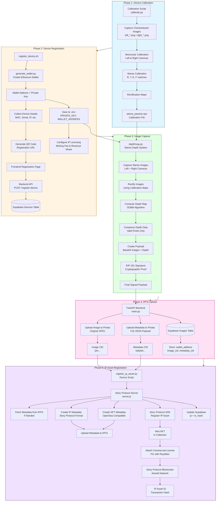

# DeepShare

A comprehensive blockchain-based evidence capture system that uses stereo vision depth mapping, IPFS storage, and Story Protocol for intellectual property protection. The system captures images with depth data, stores them on IPFS, and registers them as IP assets on the blockchain.

## Table of Contents

- [Overview](#overview)
- [System Architecture](#system-architecture)
- [Project Flow](#project-flow)
  - [Phase 1: Device Calibration](#phase-1-device-calibration)
  - [Phase 2: Device Registration](#phase-2-device-registration)
  - [Phase 3: Image Capture & Depth Mapping](#phase-3-image-capture--depth-mapping)
  - [Phase 4: IPFS Upload & Storage](#phase-4-ipfs-upload--storage)
  - [Phase 5: IP Asset Registration](#phase-5-ip-asset-registration)

---

## Overview

**Deepshare** is a decentralized evidence capture system that combines:

- **Stereo Vision Depth Mapping**: Uses dual cameras to capture images with accurate depth information
- **IPFS Storage**: Decentralized storage for images and metadata
- **Blockchain IP Protection**: Story Protocol integration for intellectual property registration
- **Cryptographic Signing**: EIP-191 signatures for data authenticity

The system is designed to run on Raspberry Pi devices or any system with dual cameras, providing tamper-proof evidence capture with blockchain-backed provenance.

---

## System Architecture



---

## Project Flow

### Phase 1: Device Calibration

**Location**: `device-pi/callibration/calibrate.py`

**Purpose**: Calibrate stereo cameras to enable accurate depth mapping.

#### Process:

1. **Capture Calibration Images**
   - Take multiple pairs of images (left/right) of a checkerboard pattern
   - Store in `calibration_images/` directory
   - Typically 30-40 image pairs for accuracy

2. **Monocular Calibration**
   - Calibrate each camera individually
   - Computes camera matrix and distortion coefficients
   - Improves overall stereo calibration accuracy

3. **Stereo Calibration**
   - Compute relative position and orientation between cameras
   - Calculates rotation matrix (R) and translation vector (T)
   - Essential parameters: Essential matrix (E) and Fundamental matrix (F)

4. **Rectification**
   - Generate rectification maps for both cameras
   - Ensures epipolar lines are horizontal
   - Output: `stereo_params.npz` containing:
     - `mapL1`, `mapL2`: Left camera rectification maps
     - `mapR1`, `mapR2`: Right camera rectification maps
     - `Q`: Disparity-to-depth mapping matrix
     - Camera matrices and distortion coefficients

#### Usage:
```bash
cd device-pi/callibration
python calibrate.py
```

**Output**: `stereo_params.npz` (required for depth mapping)

---

### Phase 2: Device Registration

**Location**: `device-pi/register_device.sh` + `device-pi/generate_wallet.py`

**Purpose**: Register device in the system and generate cryptographic identity.

#### Process:

1. **Wallet Generation** (`generate_wallet.py`)
   - Creates new Ethereum wallet using `eth_account`
   - Generates private key and wallet address
   - Collects device hardware details (hostname, MAC, serial, etc.)

2. **Device Registration** (`register_device.sh`)
   - Generates QR code with registration URL
   - URL includes wallet address and device details
   - Prompts for IP licensing configuration:
     - **Minting Fee**: Cost to mint a license (in IP tokens)
     - **Revenue Share**: Percentage for commercial use (0-100%)

3. **Frontend Registration**
   - User scans QR code or visits registration URL
   - Reviews device details
   - Submits registration to backend

4. **Backend Storage** (`backend/main.py`)
   - Stores device in Supabase `Devices` table
   - Links wallet address to device details
   - Enables device verification for captures

5. **Configuration Storage**
   - Saves to `.env` file:
     - `PRIVATE_KEY`: Device's private key (for signing)
     - `WALLET_ADDRESS`: Device's wallet address
     - `IP_MINTING_FEE`: License minting fee
     - `IP_REVENUE_SHARE`: Revenue share percentage
     - `STORY_SERVER_URL`: Story Protocol server URL
     - `IPFS_SERVICE_URL`: IPFS backend service URL

#### Usage:
```bash
cd device-pi
./register_device.sh
```

**Prerequisites**:
- Python 3 with `eth-account` and `qrcode` packages
- Backend service running and accessible
- Frontend registration page available

**Output**: 
- `.env` file with device credentials
- QR code for registration
- Device registered in Supabase

---

### Phase 3: Image Capture & Depth Mapping

**Location**: `device-pi/depthmap.py`

**Purpose**: Capture stereo images, compute depth maps, and prepare signed payload.

#### Process:

1. **Camera Initialization**
   - Opens left and right cameras
   - Loads calibration parameters from `stereo_params.npz`
   - Configures camera settings (640x480, 15 FPS)

2. **Image Capture**
   - Synchronized capture from both cameras
   - Rectifies images using calibration maps
   - Ensures epipolar alignment

3. **Depth Computation**
   - Uses Semi-Global Block Matching (SGBM) algorithm
   - Computes disparity map
   - Converts disparity to depth using Q matrix

4. **Visualization**
   - Creates 5-view display:
     - **Top Row**: Left Camera | Right Camera | Stereo Depth Map
     - **Bottom Row**: Depth-Enhanced View | Depth Overlay Visualization

5. **Data Capture** (SPACE key)
   - Saves left image as JPEG
   - Saves composite view image
   - Compresses depth data:
     - Stores only valid (non-zero) pixels
     - Saves indices and values separately
     - Includes statistics (min, max, mean, std)

6. **Payload Creation**
   - Converts images to base64
   - Compresses depth data
   - Creates data structure:
     ```json
     {
       "timestamp": 1234567890,
       "baseImage": "base64_encoded_jpeg",
       "depthImage": "base64_encoded_composite",
       "depthData": {
         "shape": [480, 640],
         "dtype": "float32",
         "min": 0.5,
         "max": 10.0,
         "mean": 3.2,
         "std": 1.5,
         "valid_pixels": 150000,
         "indices_y": [...],
         "indices_x": [...],
         "values": [...]
       }
     }
     ```

7. **EIP-191 Signing**
   - Signs payload using device's private key
   - Uses Ethereum message signing (EIP-191)
   - Creates cryptographic proof of authenticity

8. **Final Payload**
   ```json
   {
     "data": { /* payload from step 6 */ },
     "signature": "0x1234...abcd"
   }
   ```

#### Controls:
- **SPACE**: Capture image and upload to IPFS
- **+/-**: Adjust depth blend strength
- **s**: Save full screenshot
- **x**: Swap left/right cameras
- **ESC**: Exit

#### Usage:
```bash
cd device-pi
python depthmap.py
```

**Prerequisites**:
- Calibration complete (`stereo_params.npz` exists)
- Device registered (`.env` file with credentials)
- Two cameras connected and accessible

**Output**:
- Local image files (`capture_<timestamp>_left.jpg`)
- Depth metadata JSON (`depth_meta_<timestamp>.json`)
- Compressed depth data (`depth_data_<timestamp>.npz`)

---

### Phase 4: IPFS Upload & Storage

**Location**: `backend/main.py`

**Purpose**: Upload images and metadata to IPFS via Pinata, store CIDs in Supabase.

#### Process:

1. **Receive Upload Request**
   - Endpoint: `POST /upload-json`
   - Receives:
     - `wallet_address`: Device wallet address
     - `image`: Original JPEG image file
     - `metadata`: JSON string with full payload (base64 images, depth data, signature)

2. **Image Upload to IPFS**
   - Uploads original image to Pinata
   - Creates metadata with wallet address
   - Returns image CID (Content Identifier)

3. **Metadata Upload to IPFS**
   - Uploads full metadata JSON to Pinata
   - Includes:
     - Base64 encoded images
     - Compressed depth data
     - EIP-191 signature
     - Timestamp
     - Image CID reference
   - Returns metadata CID

4. **Supabase Storage**
   - Stores in `images` table:
     - `wallet_address`: Device wallet (lowercase)
     - `image_cid`: IPFS CID of original image
     - `metadata_cid`: IPFS CID of metadata JSON
   - Enables querying by wallet address

5. **Response**
   ```json
   {
     "success": true,
     "cid": "QmaLRFE...",
     "metadata_cid": "bafybeico...",
     "gateway_url": "https://gateway.pinata.cloud/ipfs/...",
     "wallet_address": "0x..."
   }
   ```

#### API Endpoints:

**Health Check**:
```http
GET /health
```

**Check Registration**:
```http
GET /check-registration/{wallet_address}
Response: { "registered": true, "wallet_address": "0x..." }
```

**Upload Image & Metadata**:
```http
POST /upload-json
Content-Type: multipart/form-data

Form Data:
- wallet_address: "0x..."
- image: <JPEG file>
- metadata: <JSON string>
```

#### Configuration:

**Environment Variables** (`.env`):
```bash
# Pinata Configuration
PINATA_JWT=your_jwt_token
# OR
PINATA_API_KEY=your_api_key
PINATA_SECRET_KEY=your_secret_key
PINATA_GATEWAY=your_gateway.mypinata.cloud

# Supabase Configuration
SUPABASE_URL=https://your-project.supabase.co
SUPABASE_SERVICE_ROLE_KEY=your_service_role_key
```

#### Usage:
```bash
cd backend
python main.py
# Server runs on port 8000 (default)
```

**Prerequisites**:
- Pinata account with API credentials
- Supabase project with `images` and `Devices` tables
- Python dependencies installed

---

### Phase 5: IP Asset Registration

**Location**: `story-server/server.js` + `device-pi/register_ip_asset.py`

**Purpose**: Register captured images as IP assets on Story Protocol with commercial licenses.

#### Process:

1. **Device Initiates Registration** (`register_ip_asset.py`)
   - Called automatically after successful IPFS upload
   - Sends request to Story Protocol server:
     ```json
     {
       "imageCid": "QmaLRFE...",
       "metadataCid": "bafybeico...",
       "depthMetadata": { /* depth stats */ },
       "deviceAddress": "0x...",
       "mintingFee": "0.1",
       "commercialRevShare": 10
     }
     ```

2. **Story Server Processing** (`server.js`)
   - Receives registration request
   - Fetches metadata from IPFS (if needed)
   - Creates IP metadata (Story Protocol format)
   - Creates NFT metadata (OpenSea compatible)
   - Uploads both metadata JSONs to IPFS

3. **Collection Management**
   - Creates NFT collection on first registration
   - Collection name: "DeepShare Evidence Collection"
   - Symbol: "DEEPSHARE"
   - Reuses collection for subsequent registrations

4. **IP Asset Registration**
   - Registers IP asset using Story Protocol SDK
   - Mints NFT in the collection
   - Attaches commercial license (PIL - Programmable IP License):
     - **Minting Fee**: Cost to mint a license (in IP tokens)
     - **Revenue Share**: Percentage for commercial use
     - **Currency**: WIP token (Story Protocol's native token)

5. **Metadata Structure**

   **IP Metadata** (Story Protocol):
   ```json
   {
     "title": "DeepShare Evidence - 1234567890",
     "description": "Evidence capture with depth mapping...",
     "image": "ipfs://QmaLRFE...",
     "mediaUrl": "ipfs://bafybeico...",
     "creators": [{
       "name": "DeepShare Device",
       "address": "0x...",
       "contributionPercent": 100
     }],
     "attributes": [
       { "key": "Platform", "value": "DeepShare" },
       { "key": "Device", "value": "0x..." },
       { "key": "ImageCID", "value": "QmaLRFE..." }
     ]
   }
   ```

   **NFT Metadata** (OpenSea compatible):
   ```json
   {
     "name": "DeepShare Evidence 1234567890",
     "description": "Evidence captured with depth mapping...",
     "image": "ipfs://QmaLRFE...",
     "animation_url": "ipfs://bafybeico...",
     "attributes": [
       { "trait_type": "Platform", "value": "DeepShare" },
       { "trait_type": "Device", "value": "0x..." },
       { "trait_type": "Has Depth Data", "value": "Yes" }
     ]
   }
   ```

6. **Supabase Update**
   - Updates `images` table with:
     - `ip`: IP asset explorer URL
     - `tx_hash`: Blockchain transaction hash

7. **Response**
   ```json
   {
     "success": true,
     "data": {
       "ipId": "0xF0A67d1776887077E6dcaE7FB6E292400B608678",
       "tokenId": "1",
       "txHash": "0x54d35b50694cd...",
       "nftContract": "0xBBE83B07463e5784BDd6d6569F3a8936127e3d69",
       "explorerUrl": "https://aeneid.explorer.story.foundation/ipa/0xF0A...",
       "mintingFee": 0.1,
       "commercialRevShare": 10
     }
   }
   ```

#### Configuration:

**Environment Variables** (`story-server/.env`):
```bash
# Server Wallet (pays for all registrations)
PRIVATE_KEY=0x...

# Network Configuration
RPC_URL=https://aeneid.storyrpc.io
CHAIN_ID=aeneid
PORT=3003

# Default Royalty Settings (can be overridden per request)
DEFAULT_MINTING_FEE=0.1
DEFAULT_COMMERCIAL_REV_SHARE=10

# IPFS Gateway
IPFS_GATEWAY=https://gateway.pinata.cloud

# Pinata (for metadata uploads)
PINATA_API_KEY=...
PINATA_SECRET_KEY=...

# Supabase (for storing IP registration data)
SUPABASE_URL=https://your-project.supabase.co
SUPABASE_SERVICE_ROLE_KEY=...
```

#### Usage:

**Start Story Server**:
```bash
cd story-server
npm install
npm start
```

**Manual Registration** (from device):
```bash
cd device-pi
python register_ip_asset.py <image_cid> <depth_meta_file> [metadata_cid] [minting_fee] [revenue_share]
```

**Prerequisites**:
- Story Protocol SDK installed
- Server wallet funded with IP tokens (for gas fees)
- Supabase configured
- Pinata credentials for metadata uploads

**Gas Costs**:
- Collection creation: ~0.037 IP (one-time)
- IP registration: ~0.037 IP (per image)
- Estimate: ~100 images per 10 IP tokens

---

